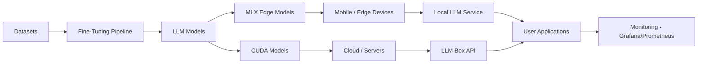
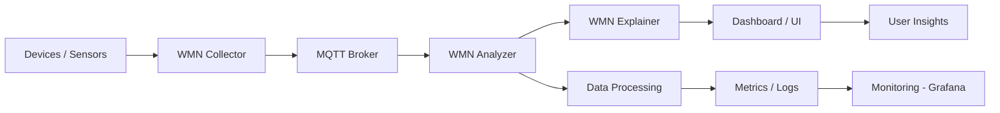

<h1 align="center">⚡ Irfan Uruchi</h1>

  AI Systems Engineer · Distributed Systems Builder · Computer Engineering

  <a href="https://huggingface.co/Irfanuruchi">🤗 Hugging Face</a> •
  <a href="https://github.com/IrfanUruchi">💻 GitHub</a> •
  <a href="https://irfanuruchi.in">🌐 Portfolio</a>

  Building scalable AI systems from edge devices to distributed cloud infrastructure.

---

## 👋 About Me

Computer Engineering student focused on building AI systems, distributed infrastructure, and real-world engineering tools.

I work on turning ideas into scalable, deployable systems — from edge AI to cloud-native architectures.

---

## 🚀 Highlights

- 📱 4 iOS apps published  
- 🤖 30+ LLMs & variants (MLX, LoRA, full fine-tunes)  
- 🐳 10+ Dockerized systems (multi-architecture)  
- ☁️ Distributed edge-cloud infrastructure  
- ⚙️ Hardware + software + AI integration  

---

## 🤖 LLM Ecosystem

### Core Models
- LLaMA (1B → 13B)  
- Qwen2.5 (0.5B → 1.5B + LoRA variants)  
- Phi-2 / Phi-4-mini  
- SmolLM (135M → 1.7B)  

### Edge / MLX Optimized
- MLX quantized models (4-bit / 5-bit / 8-bit)  
- Apple Silicon optimized inference  
- Sub-500MB deployable LLMs  

### Domain-Specific AI
- Building Engineering models  
- HVAC diagnostic LLMs  
- DSP / Signal Processing models  
- Engineering validation (“precheck”) systems  

### Dataset Engineering
- Building Engineering Synthetic Dataset (v5 – 60k samples)  
- HVAC validation datasets  
- DSP datasets (sampling, aliasing)  
- Multi-version dataset pipelines (v3 → v5)  

🔗 https://huggingface.co/Irfanuruchi  

---

## 🧠 AI + Systems Architecture

---

## Distributed Systems & Docker

## Edge Mini Cloud System

🔗 https://github.com/IrfanUruchi/Distributed-edge-mini-cloud-Docker
- 14+ services in one system
- Nextcloud, Grafana, Prometheus
- LLM UI + inference nodes
- Multi-arch (ARM64 + x86_64)
- Runs on Raspberry Pi + servers

---

## LLM Proxy

- Multi-node reverse proxy for LLM systems
- Enables distributed inference routing

---

## WMN System (Wireless Monitoring Network)

- Collector → Analyzer → Explainer pipeline
- Real-time telemetry processing
- MQTT-based distributed architecture

## 📡 Distributed WMN System

--- 

## Local LLM Service

- Self-hosted LLM with persistent chat memory
- Multi-session support

---
## ALPR Gate System

- YOLOv8 + EasyOCR on Raspberry Pi
- Arduino-controlled automation
- Fully deployed edge AI system

--- 

## LM Box

- Containerized LLM serving (FastAPI + UI)
- Lightweight deployment pipeline

---

## Cloud & Systems Engineering

📉 Real-Time Price Alert System

- Event-driven architecture
- Real-time stock monitoring and alerts

---

## What I’m Exploring

- OS & Hypervisor development
- On-device LLM inference (mobile + edge)
- Compiler theory
- Advanced Mathematics & Kinetics
- Mechanical & Building Engineering
- AI + Systems integration

---

# Tech Stack

## Languages

Swift · Kotlin · Python · C/C++ · Assembly · Fortran · Verilog · Haskell · Prolog

## AI / ML

PyTorch · Transformers · QLoRA · MLX · Fine-tuning

## Systems

Docker · Linux · Networking · Distributed Systems

## Hardware

FPGA · Microcontrollers · Raspberry Pi
