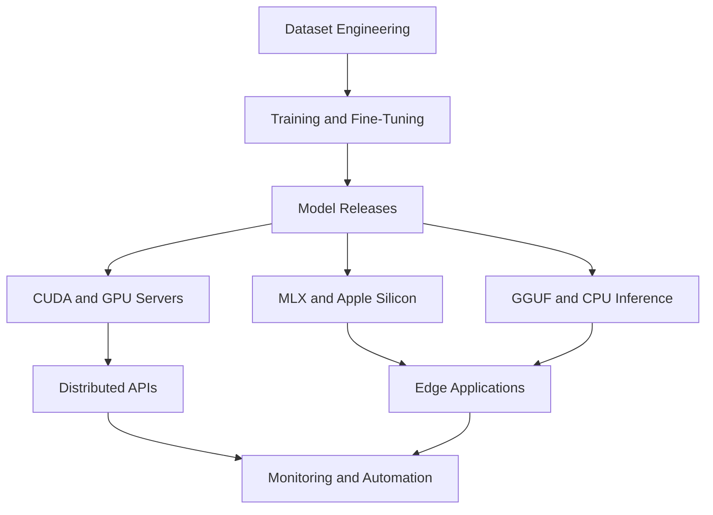
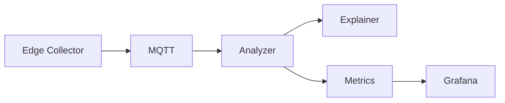

<h1 align="center">⚡ Irfan Uruchi</h1>

  Computer Engineer · AI Systems · Distributed Systems · Edge Computing

  <a href="https://huggingface.co/Irfanuruchi">🤗 Hugging Face</a> •
  <a href="https://hub.docker.com/u/irfanuruchi">🐳 Docker Hub</a> •
  <a href="https://apps.apple.com/rw/developer/irfan-uruci/id1761565214">📱 App Store</a> •
  <a href="https://irfanuruchi.in">🌐 Portfolio</a>

  I build AI and distributed systems that run across workstations, servers, Raspberry Pis, laptops, and mobile devices.

---

## About Me

I’m a Computer Engineer who enjoys building complete systems from the hardware level up. My work includes custom processor designs, Raspberry Pi and edge deployments, distributed services, mobile apps, and domain-specific language models.

I graduated from South East European University in 2026 with a 240 ECTS B.Sc. in Computer Engineering.

---

## Highlights

- 🏗️ Built BuildEng V8, a domain-specific 32B engineering language model
- 📚 Created a validated engineering dataset containing 145,117 samples
- 🤖 Published 30+ models, adapters, conversions, and quantized variants
- 📱 Released four iOS applications
- 🌐 Built distributed systems using FastAPI, gRPC, Protobuf, MQTT, and Docker
- 🐳 Deployed multi-architecture systems across ARM64 and x86_64
- 🧠 Worked with CUDA, MLX, GGUF, OpenVINO, QLoRA, and local inference
- ⚙️ Built projects spanning AI, software, networking, embedded systems, and hardware

---

# BuildEng

BuildEng is my main domain-specific AI project: a family of language models and datasets for civil engineering, structural reasoning, construction workflows, HVAC, field diagnostics, and conservative engineering assistance.

The models are designed to separate observations from confirmed diagnoses, ask for missing information, recognize structural risk, and avoid giving unsupported engineering approval.

## BuildEng V8 32B

- Based on Qwen2.5-32B-Instruct
- Fine-tuned using 4-bit QLoRA
- 145,117 validated training samples
- 4,096-token training sequences
- 1.5B, 3B, and 32B model branches
- Merged FP16 model and GGUF releases
- F16, Q5_K_M, and Q4_K_M variants
- MLX versions for Apple Silicon
- OpenVINO exports for CPU and Intel hardware
- Compatible with llama.cpp, Ollama, LM Studio, and other local runtimes

  <a href="https://huggingface.co/Irfanuruchi/buildeng">📚 Dataset</a> •
  <a href="https://huggingface.co/Irfanuruchi/qwen2.5-32b-buildeng-GGUF-F16">🧠 BuildEng V8 32B</a> •
  <a href="https://huggingface.co/Irfanuruchi/qwen2.5-3b-buildeng">⚙️ BuildEng 3B</a> •
  <a href="https://huggingface.co/Irfanuruchi/qwen2.5-1.5b-buildeng">🪶 BuildEng 1.5B</a>

## Other Model Work

- Computer Engineering LLMs from 1B to 13B
- Bilingual English–Albanian DSP model
- HVAC and engineering precheck models
- Computer networking models
- Phi-2 and Phi-4-mini experiments
- SmolLM and sub-500 MB edge models
- LoRA and QLoRA adapter training
- GGUF, MLX, Core ML, and OpenVINO conversion pipelines

---

## AI Deployment Pipeline

---

# Distributed and Edge Systems

## Distributed Task Orchestration System

A distributed platform for scheduling and executing work across multiple machines.

- Central FastAPI coordinator
- gRPC and Protobuf worker communication
- Persistent SQLite task queue
- Dynamic worker registration
- Worker heartbeat monitoring
- Automatic retries and cooldown handling
- Worker re-registration after coordinator restarts
- Round-robin and load-aware scheduling
- Capability-aware routing for CPU, memory, and general tasks
- Benchmark dashboard and scheduler comparison
- Dockerized coordinator and workers

The system was tested across independent Linux and macOS devices rather than simulated workers on one machine.

---

## Intelligent Fog Orchestration System

A fog-computing platform for controlling and recovering containerized workloads across distributed smart nodes.

- MQTT communication
- Desired-state reconciliation
- Live node telemetry and event reporting
- Runtime and container monitoring
- Automatic workload recovery
- CPU and memory safety limits
- Remote deployment over LAN and Tailscale
- Ollama-based local LLM workload
- MobileNetV2 edge-classification workload
- Central controller dashboard

---

## PMDrop

[PMDrop](https://github.com/IrfanUruchi/PMDrop) is a local-only file-transfer system built around a Raspberry Pi.

- FastAPI backend
- SQLite metadata storage
- File upload, download, listing, and deletion
- Device registration and heartbeats
- Browser signaling layer
- Raspberry Pi LAN hub
- Ethernet and Wi-Fi device support
- Docker and Docker Compose deployment
- ARM64 and x86_64 container images

Current work includes direct WebRTC transfers, QR pairing, device discovery, and desktop notifications.

---

## Wireless Monitoring Network

[WMN System](https://github.com/IrfanUruchi/wmn-system) is a distributed network-quality monitoring platform.

- Edge collectors measure RSSI, latency, jitter, and packet loss
- MQTT-based telemetry transport
- Analyzer calculates wireless QoE scores
- Alert generation and analytics
- Explanation service for user-readable diagnostics
- Offline telemetry spooling
- Grafana-based monitoring
- Deployment across WSL, Raspberry Pi, and Proxmox

---

## Edge Distributed Mini Cloud

[Edge Mini Cloud](https://github.com/IrfanUruchi/Distributed-edge-mini-cloud-Docker) combines multiple self-hosted services into one deployable environment.

- 14+ integrated services
- Nextcloud
- Grafana and Prometheus
- Jupyter
- Samba
- Local LLM interface
- ARM64 and x86_64 support
- Raspberry Pi and server deployment
- Docker-based installation

---

## Local LLM Service

A self-hosted local inference service with persistent conversation storage.

- Browser-based chat interface
- Multiple chat sessions
- Persistent SQLite history
- Conversation renaming
- Built-in GGUF model
- Custom model override through environment variables
- Configurable context size and GPU layers
- Multi-architecture Docker images

---

## Adaptive IoT Gateway

[Adaptive IoT Gateway](https://github.com/IrfanUruchi/Adaptive-IoT-Gateway) is a Raspberry Pi gateway for local device and network management.

- MQTT communication
- Context-aware automation
- AdGuard integration
- Grafana monitoring
- Containerized deployment
- Local network telemetry

---

# Data and Backend Systems

## NoSQL Retail Migration

A complete relational-to-document-database migration and analytics system built using the Olist retail dataset.

- PostgreSQL 16 source database
- MongoDB 7 analytics database
- Python migration and validation pipeline
- Denormalized analytics collections
- Unique indexes and consistency checks
- Streamlit analytics dashboard
- Docker Compose deployment
- 99,441 migrated orders
- 32,951 products
- 96,096 unique customers
- Revenue, freight, and payment totals validated across both databases

---

## Real-Time Price Alert System

[Real-Time Price Alert System](https://github.com/IrfanUruchi/realtime-price-alert-system) is an event-driven stock-monitoring and alert platform.

- Live price monitoring
- Price-drop detection
- Event-driven processing
- Automated alerts
- Containerized services

---

## ProMatch

[ProMatch](https://github.com/IrfanUruchi/promatch-prolog) is a B2B event-matchmaking application written in SWI-Prolog.

- Participant and role management
- Availability and time-slot handling
- Conflict-free schedule generation
- Greedy scheduling
- CLP(FD) optimization
- Browser-based interface

---

# Edge AI and Embedded Systems

## ALPR Gate System

[ALPR Gate](https://github.com/IrfanUruchi/automated-license-plate-gate-control) is an automated gate-control system using computer vision and embedded hardware.

- YOLOv8 Nano object detection
- EasyOCR plate recognition
- Raspberry Pi deployment
- Arduino-controlled gate hardware
- Edge-based image processing
- Fully local operation

---

## Custom CPU Projects

I have also worked on computer architecture from the digital-logic level.

- Custom 8-bit CPU
- Z80-style processor architecture
- ALU, register, datapath, and control-unit design
- Logisim simulation
- Verilog and FPGA experimentation

---

# Applications

I have released four iOS applications.

## EngToolBox

[EngToolBox](https://github.com/IrfanUruchi/EngToolBox) provides engineering, mathematical, symbolic, and numerical calculation tools.

## UnitEngConverter

[UnitEngConverter](https://github.com/IrfanUruchi/UnitEngConverter) is a lightweight engineering unit-conversion application.

## Smart Study Planner

[Smart Study Planner](https://github.com/IrfanUruchi/Smart-Study-Planner) combines task planning, study timers, and academic workflow management.

## PlayAIground

[PlayAIground](https://github.com/IrfanUruchi/PlayAIground) is an on-device AI sandbox for experimenting with local models on iOS.

---

# Other Projects

## Haskell Symbolic Calculator

[Haskell Integral and Derivative Calculator](https://github.com/IrfanUruchi/Haskell-Integral-Derivative-Calculator)

A small computer algebra system with a custom symbolic language, recursive-descent parser, simplification rules, differentiation, and pattern-based integration.

## DSP Bilingual LLM

[DSP LLM Bilingual Fine-Tuning](https://github.com/IrfanUruchi/dsp-llm-bilingual-finetuning)

A complete training and dataset pipeline for adapting a lightweight LLaMA model to English and Albanian digital signal-processing tasks.

## LLM Box

[LLM Box](https://github.com/IrfanUruchi/llm-docker-app)

A lightweight FastAPI and Docker application for serving language models through a browser interface.

---

# Tech Stack

## Languages

Python · Kotlin · Swift · C · C++ · Assembly · Verilog · Fortran · Haskell · Prolog · SQL

## AI and Machine Learning

PyTorch · Transformers · Hugging Face · QLoRA · LoRA · MLX · GGUF · llama.cpp · Ollama · OpenVINO · Core ML · YOLOv8

## Backend and Distributed Systems

FastAPI · gRPC · Protobuf · MQTT · REST APIs · WebRTC · SQLite · PostgreSQL · MongoDB

## Infrastructure

Docker · Docker Compose · Linux · Proxmox · Prometheus · Grafana · Tailscale · Networking

## Hardware and Edge

Raspberry Pi · Arduino · FPGA · Microcontrollers · Apple Silicon · NVIDIA CUDA · Intel OpenVINO

## Mobile and UI

SwiftUI · Jetpack Compose · Streamlit · HTML · CSS · JavaScript

---

# Currently Exploring

- OS and hypervisor development
- On-device LLM inference
- Distributed inference routing
- WebRTC peer-to-peer systems
- Compiler design
- Computer architecture
- FPGA acceleration
- Engineering-focused AI systems

---

  <a href="https://github.com/IrfanUruchi">GitHub</a> •
  <a href="https://huggingface.co/Irfanuruchi">Hugging Face</a> •
  <a href="https://hub.docker.com/u/irfanuruchi">Docker Hub</a> •
  <a href="https://irfanuruchi.in">Portfolio</a>

